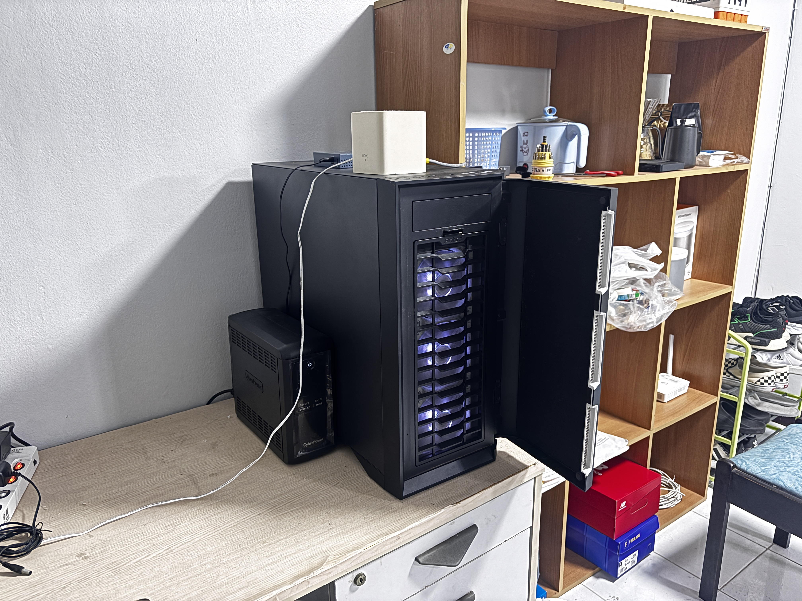
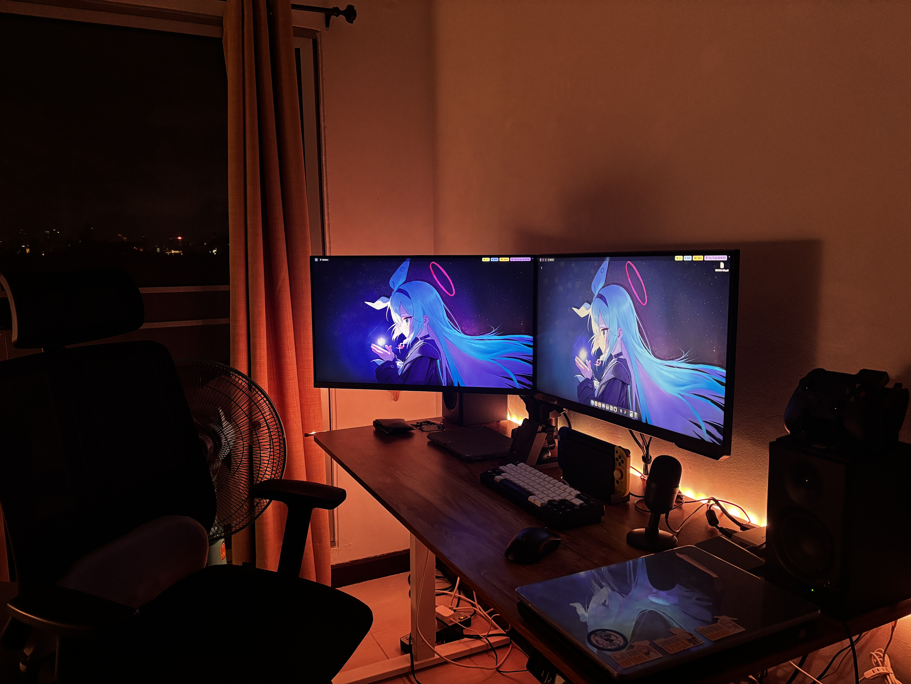
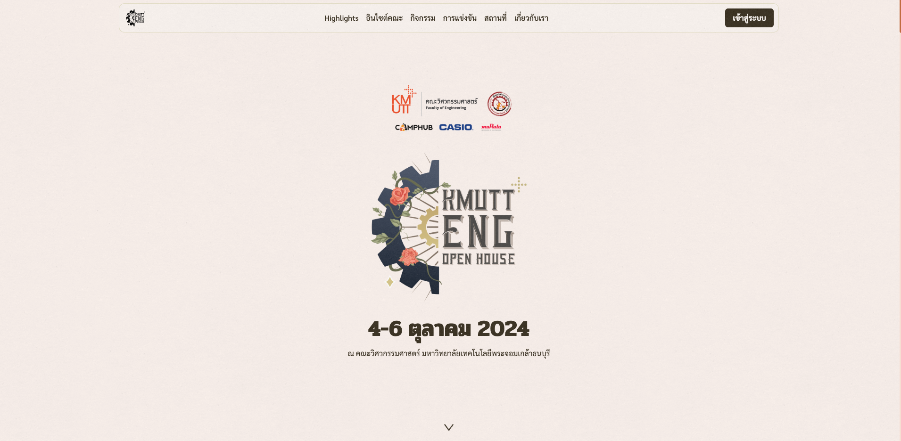

สวัสดีครับทุกคน ปี 2024 ก็จบลงไปเป็นที่เรียบร้อยแล้ว เป็นยังไงกันบ้างครับ? สำหรับบางคนอาจจะเป็นปีที่ดี แต่สำหรับผม ปีนี้มีอะไรเกิดขึ้นมากมายจริงๆ ทั้งในฐานะ “เด็กมหาลัย” และ “Developer” มือใหม่ วันนี้เลยอยากจะมาเขียนสรุปการเดินทางตลอดปีที่ผ่านมาไว้หน่อยครับ

## 🏕️ Comcamp 35

Comcamp 35 เป็นกิจกรรมค่ายสำหรับน้องๆ ม.ปลายที่จัดโดยนักศึกษาวิศวะคอมฯ ซึ่งปีนี้ผมได้รับหน้าที่เป็น Head of Technical Team หรือพูดง่ายๆ คือหัวหน้าฝ่ายพัฒนาเว็บไซต์ของค่าย

เป็นครั้งแรกที่ผมได้ลองทำงานในบทบาทที่ใกล้เคียงกับ “Project Manager” จริงจัง ซึ่งทำให้ได้เรียนรู้ทั้งด้านการบริหารทีม การสื่อสารข้ามฝ่าย (แม้บางครั้งจะมีปะทะคารมกับรุ่นพี่บ้าง 😅) และยังได้เห็นความสามารถของเพื่อนๆ ในทีมที่น่าประทับใจมากๆ

สรุปคือ แม้จะมีจุดที่พลาด แต่ค่ายนี้ก็เป็นบทเรียนสำคัญที่ทำให้รู้ว่าต้องพัฒนาทักษะการบริหารและการสื่อสารให้ดียิ่งขึ้น

## 💻 ชีวิตสาย Homelab ที่บานปลายสุดๆ

อีกอย่างที่ผมอินมากในปีนี้คือ “Homelab” หรือการทำเซิร์ฟเวอร์เล็กๆ ใช้เองที่บ้าน หลายคนอาจมองว่ามันสิ้นเปลือง (ซึ่งก็จริงอยู่บ้าง 😭) แต่สำหรับผม มันคือ passion และแหล่งเรียนรู้สำคัญ

เริ่มจากโน๊ตบุ๊คเก่าๆ ที่นำมาใช้เป็น server ตั้งแต่ปี 2021 จนมาถึงตอนนี้ ผมอัปเกรดเป็นเครื่องคอมจริงจังเพื่อรองรับ app ที่พัฒนาขึ้นเอง และเพิ่มระบบอย่าง RAID, UPS, Monitoring ฯลฯ รวมแล้วน่าจะลงทุนไปเกิน 50,000 บาท

แต่สิ่งที่ได้กลับมาคือประสบการณ์ล้ำค่าด้าน DevOps, Server Management และระบบ infrastructure ต่างๆ ที่ไม่ได้เรียนจากในห้องเรียน

> ถ้าใครอยากรู้ว่าผมลงอะไรใน Homelab บ้างเดี๋ยวมี Blog เขียนไว้ในอนาคต....

## 🏢 ย้ายหอครั้งใหญ่

ในช่วงปิดเทอม ผมได้ย้ายจากหอพักเก่าที่ “ไม่มีแอร์” ไปอยู่คอนโด (อยู่หอแบบไม่มีแอร์มันทรมานจริงๆ 😭)

พอย้ายมาคอนโด ค่าใช้จ่ายก็สูงขึ้น เลยต้องหารูมเมทร่วมแชร์ค่าใช้จ่ายกันไป ผลคือประหยัดได้พอสมควร และที่สำคัญ **วิวจากคอนโดนี่สุดยอดมากกก เห็นกรุงเทพกว้างๆ แบบเต็มตาเลย**

## 🖥️ Engineer Openhouse 2024

หนึ่งในกิจกรรมที่ผมภูมิใจที่สุดในปีนี้คือการร่วมทำเว็บไซต์ให้กับงาน Engineer Openhouse ของคณะวิศวกรรมศาสตร์ ที่ KMUTT

ผมรับผิดชอบในส่วนของ Frontend แทบทั้งหมด (จริงๆ คือทั้งหมดเลย ถ้าไม่นับช่วงที่สอบแล้วต้องขอให้รุ่นพี่ช่วย 😅) โดยในโปรเจกต์นี้มีแค่ 3 ทีมเล็กๆ — Design, Frontend, Backend — ซึ่งหมายความว่าแต่ละคนมีภาระหนักมาก

นอกจากนี้ยังต้องผ่านการรีวิวและอนุมัติจากทางสโมสรคณะและอาจารย์ ทำให้เจอรอบแก้ที่เยอะมากกกก (ใส่กอไก่ไปอีกล้านตัวก็ไม่พอ) แต่สุดท้ายก็ผ่านมาได้ และเป็นหนึ่งในผลงานที่ผมภูมิใจที่สุดในปีนี้

## ## สรุปท้ายปี

จริงๆ ปีนี้ผมยังได้ทำอย่างอื่นอีกเยอะ ทั้งรับ Freelance, ไปงาน Conference และกิจกรรมอื่นๆ ที่ไม่ได้เขียนถึงในโพสต์นี้

โดยรวมแล้ว ปี 2024 สำหรับผมถือว่าเป็นปีที่ “คุ้ม” มาก ได้เจอผู้คนใหม่ๆ ได้ใช้เงินแลกประสบการณ์และความรู้ ได้ลองผิดลองถูกในบทบาทต่างๆ ทั้งในมหาลัยและนอกห้องเรียน

แม้จะมีเรื่องแย่ๆ อยู่บ้าง แต่ก็มีเรื่องดีๆ ที่น่าจดจำมากมาย

ขอให้ปี 2025 เป็นปีที่ดียิ่งกว่าเดิมสำหรับทุกคนเช่นกันครับ

**สุขสันต์วันปีใหม่ครับผม 🎉🥳**